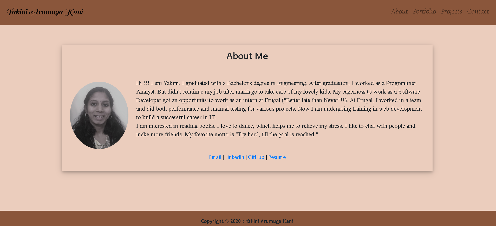
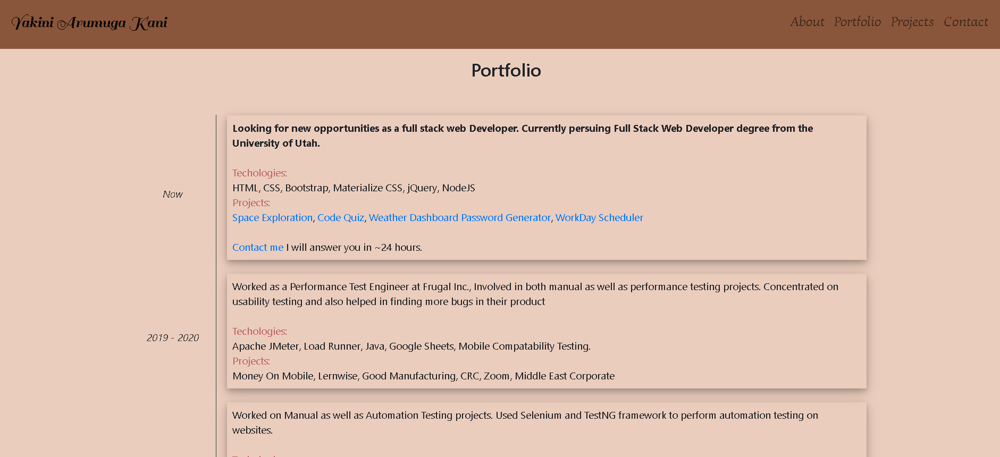
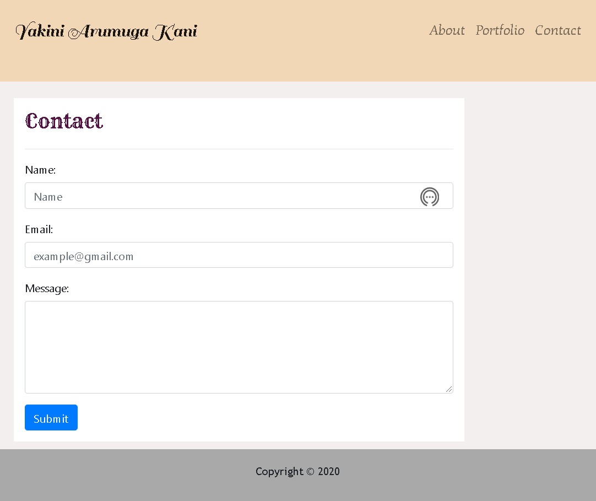

## Unit 02 CSS and Bootstrap: Responsive Portfolio

This assignment mainly focuses on a responsive view, the web application should display correctly on various devices.That means if it's an `xs` screen, content is displayed on the entire screen. On `sm` and larger screens, there are some margins present on either side of the screen. The web application is primarily developed by using Bootstrap and responsive view achieved by using media queries as needed.I also used an HTML validation service to ensure that it's a proper and valid HTML.

### About Page/Home Page

* The file "index.html" is for About Page/Home Page.
* This page has a navigation bar(navbar) with name on the left side and About, Portfolio and Contact Us links on the right side. On clicking the links results in the respective page.
* The navbar is responsive when viewed on different devices with the help of media queries on the "style.css" file.
* The image on the About page is made responsive by using CSS styling.
* Contain personal details including bio, name, image, and social media links.
* Used Bootstrap's grid system (containers, rows, and columns) to get a proper view on various screens.
* Used Semantic HTML elements as needed.
* The footer is located at the bottom of the page. It is made as Sticky footer, which means the footer always sticks to the bottom regardless of the content. This is achieved mainly by using CSS. 

### Portfolio Page

* The file "portfolio.html" is for Portfolio Page.
* This page also has a responsive navigation bar with name and nav links like in the homepage. On clicking the links takes to the corresponding pages.
* Appropriate font styling is given for the heading.
* Bootstrap's grid system is used for aligning the images properly.
* Used the class attributes imagecontainer, text-block for aligning the text content with the image properly.
* The images and the layout are highly responsive.
* Like Homepage, the sticky footer is present at the bottom of the page.

### Contact Page

* The file "Contact.html" is for Contact Page.
* The contact page also has a responsive navigation bar with name and nav links, on clicking the links results in the corresponding pages.
* It has Name, Email, Message, and Submit fields. All these are written using Bootstrap.
* Advantage of using Bootstrap in forms is that default validation feedback for fields is given.
* The styling and alignment issues are minimized with the help of Bootstrap. They provide a wide range of shorthand responsive margin and padding utility classes to modify an element's appearance.
* Like Homepage, the sticky footer is present at the bottom of the page.

### Challenges Faced

* In this application, I used media queries to make the navbar as responsive and used display: flex; flex-direction: row to achieve as expected. Another way is by using buttons in Bootstrap, but this results in `buttons` on small screen size and on clicking that we can see the nav links(About, Portfolio, Contact). [For more details refer Bootstrap documentation](https://getbootstrap.com/docs/4.5/components/navbar/)

* To make footer as a sticky one, used min-height:100vh, position: relative in the body CSS file and made the width as 100% in the footer.

* In the portfolio page, the text contents have to properly align with its corresponding image and should be responsive as well. For that, text-contents are placed inside the class "text-block," and by applying CSS, it properly aligns with the image on the page.

* Used HTML Validator Service to validate my HTML and corrected two errors in the code and ensured that no major mistakes are present.
[HTML Validation Service](https://html5.validator.nu/) 

#### Screenshots

Here's the link to my developed Website : [CSS-Bootstrap-ResponsivePortfolio](https://yakinia.github.io/02-CSS-Bootstrap-ResponsivePortfolio/index.html)

##### References

W3Schools : [W3Schools](https://www.w3schools.com/howto/howto_css_image_text_blocks.asp) 
Bootstrap : [Bootstrap Documentation](https://getbootstrap.com/docs/4.5/getting-started/introduction/) 
Video On Footer : [Footer Video](https://www.youtube.com/watch?v=US_3XvufMLU)
