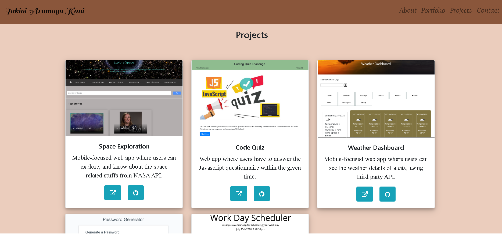
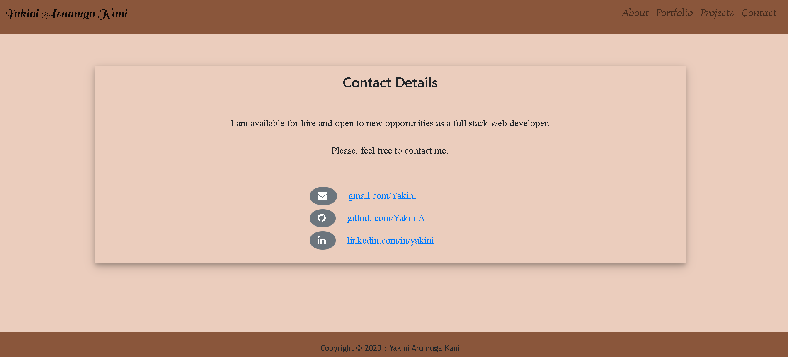

## Unit 02 CSS and Bootstrap: Responsive Portfolio

This assignment mainly focuses on updating the already existing portfolio. The web application is primarily developed by using Bootstrap and responsive view achieved by using media queries as needed. This is an updated portfolio with more information and project details.

### About Page/Home Page

* The file "index.html" is for About Page/Home Page.
* This page has a navigation bar(navbar) with name on the left side and About, Portfolio, Projects and Contact Us links on the right side. On clicking the links results in the respective page.
* The navbar is responsive when viewed on different devices with the help of Bootstrap.
* Contain personal details including bio, name, image, and social media links.
* Used Bootstrap's grid system (containers, rows, and columns) to get a proper view on various screens.
* The footer is located at the bottom of the page. It is made as Sticky footer, which means the footer always sticks to the bottom regardless of the content. This is achieved mainly by using CSS. 

### Portfolio Page

* The file "portfolio.html" is for Portfolio Page.
* This page contains details regarding the experiences listed yearwise in detail.
* Applied some cool styling for this page.

### Projects Page

* The file "projects.html" is for Projects Page.
* This page also has a responsive navigation bar with name and nav links like in the homepage. On clicking the links takes to the corresponding pages.
* Bootstrap's card is used for aligning the images with text properly.
* The images and the layout are highly responsive.
* Like Homepage, the sticky footer is present at the bottom of the page.

### Contact Page

* The file "Contact.html" is for Contact Page.
* The contact page also has a responsive navigation bar with name and nav links, on clicking the links results in the corresponding pages.
* The styling and alignment issues are minimized with the help of Bootstrap. They provide a wide range of shorthand responsive margin and padding utility classes to modify an element's appearance.
* Like Homepage, the sticky footer is present at the bottom of the page.

#### Screenshots

Here's the link to my developed Website : [RecentPortfolio](https://yakinia.github.io/08-UpdatedPortfolio/index.html)

##### References

Bootstrap : [Bootstrap Documentation](https://getbootstrap.com/docs/4.5/getting-started/introduction/) 
W3Schools : [W3Schools-ForStyling](https://www.w3schools.com/css/css_howto.asp)